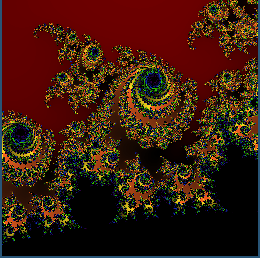
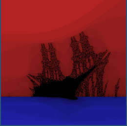

# Fractal Renderer

## Usage

1. Compile: `nim c main.nim`
2. Run: `./main <options...>`
3. Use mouse to click/drag draw area to zoom into.

## Example output




```
./main -f:mandelbrot -c:roygbiv -w:256 -h:256 \
  -p:0.3291233577328967,-0.05800491402624175,0.3297866649882053,-0.0573523121420294`

./main -f:burningship -c:onthesea -w:256 -h:256 \
  -p=-1.817511,-0.117813,-1.701644,0.034875
```

## Questions

* I'm not sure I like the way the command line parser works.  I'm used to being
  able to leave a space between the option and its value: `-w 256`.  The nim
  `parseopt2` module seems to require a colon or equals between the option and
  its argument: `-w:256` or `-w=256`.

* It seems I have to import the `tables` module in my `main` module because I'm
  using `Table`s exported by `functions` and `colors`.  If I don't import
  `tables` in my `main` module, the compiler is unable to resolve the `[]`
  procedure for the tables.

* I'm surprised that in a proc I apparently can't modify the parameters (e.g.
  I might want to swap `x0` and `x1` in `util.drawSquareXor`).

* Is there a better way to initialize `Table`s?  (e.g. `colorFunc` in `colors`
  and `fractalFunc` in `functions`).

* Is there a better way to initialize a specialized array? (e.g. `rainbow` in
  `colors`).

* The `do` syntax for anonymous functions seems a little peculiar.

  * All other procs are `(args: types): rettype = ...` whereas the `do`
    notation is `do (args: types) -> rettype: ...`

  * I'd still prefer to use parentheses to notate the function call.  Apparetly
    I can't use them with do:

    ```
    frac.setFunction(do (x,y: float, b: int) -> uint32:
      return cf(x, y, ff(x, y, b)))
	```

## Requirements

1.  SDL2 libraries
	```
	sudo apt-get install libsdl2-2.0 \
		libsdl2-gfx-1.0-0 \
		libsdl2-image-2.0-0 \
		libsdl2-mixer-2.0-0 \
		libsdl2-net-2.0-0 \
		libsdl2-ttf-2.0-0 \
		libsdl2-dev
	```

2.  nim sdl2 module
	```
	nimble install sdl2
	```
